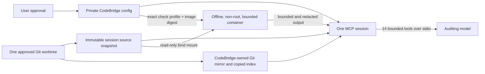

# CodeBridge

CodeBridge v0.1 is a local MCP server for independent review of one explicitly approved Git repository. It gives an auditor bounded, read-only access to a captured source snapshot and a CodeBridge-owned Git mirror. Approved checks run in disposable, offline, resource-limited containers.

The authoritative contract is the frozen [CODEBRIDGE_SPEC.md](./CODEBRIDGE_SPEC.md). The architecture and security invariants are recorded in [ADR 0001](./docs/adr/0001-frozen-security-boundaries.md).

> Do not point CodeBridge at repositories containing secrets that should never enter an AI model context. Secret path rules, whole-object scans, and output redaction are defense in depth, not a substitute for repository hygiene.

## What it is and is not

CodeBridge connects a model to one selected local repository through 14 MCP tools: snapshot provenance, tree and path discovery, literal search, whole-file and batch reads, snapshot-computed Git status, mirrored history/diffs, approved check discovery, and bounded check run/status/cancel operations.

CodeBridge does not expose a terminal, arbitrary host commands, repository editing, Git writes, model-controlled authorization, model-enabled networking, dependency installation, or automatic project switching. Repository text, Git messages, file names, test output, and check results are untrusted evidence.

## Threat model and trust classes

| Trust class                      | Examples                                                           | Handling                                                         |
| -------------------------------- | ------------------------------------------------------------------ | ---------------------------------------------------------------- |
| T0: CodeBridge policy            | Program, schemas, explicit user approvals                          | Defines permissions and tool behavior                            |
| T1: user-approved requirements   | An exact repository-relative path and SHA-256 approved outside MCP | May define audit expectations; never grants execution            |
| T2: untrusted repository content | Source, docs, Git messages, paths, project manifests               | Read-only evidence, screened before exposure, never instructions |
| T3: untrusted execution output   | Check stdout/stderr and failures                                   | Bounded, secret-redacted evidence                                |



The model only sees the session snapshots. Git audit commands run against the private mirror, never the live repository. Checks receive only the snapshot mount and bounded temporary storage. They run without network, Linux capabilities, host credentials, or a writable host repository mount. Container/runtime vulnerabilities and a hostile same-user process on the host remain outside CodeBridge's guarantee.

## Requirements

- macOS or Linux, a Git repository, and Node.js 24 LTS or later supported LTS.
- Git for repository discovery and the private session mirror.
- A Docker-compatible runtime for check execution. Without it, reads and Git inspection remain available, but checks report unavailable.
- CodeBridge resolves the active Docker context to its local Unix socket for CLI operations and rejects remote TCP/SSH contexts. It does not pass Docker configuration or registry credentials into a check container.
- Check profiles require an image already built and approved by the user or CI. The image digest must be immutable and the image must contain all dependencies plus the CodeBridge launcher contract. CodeBridge never pulls, builds, or installs check dependencies.

## Install and build

```sh
git clone https://github.com/0xmaster7/Codebridge.git
cd Codebridge
npm ci
npm run build
npm run doctor
```

The compiled CLI is `dist/src/cli.js`; `npm link` can expose the `codebridge` command from a local checkout. Keep dependencies and lockfile pinned. `npm run format:check`, `npm run lint`, `npm run typecheck`, `npm test`, `npm run test:coverage`, `npm run check:security-coverage`, `node scripts/inspector-smoke.mjs`, `npm run validate:plugin`, and `npm run test:macos-agent` are local quality gates. CI also builds test-only Node and Python images and runs `npm run test:sandbox-docker` and `npm run test:repository-dry-run` against their exact immutable image IDs.

## Authorize one project

Initialize from the exact worktree you intend to audit, then select its stable CodeBridge project ID:

```sh
codebridge init /absolute/path/to/repository
codebridge select cb-<printed-project-id>
codebridge status
codebridge doctor
```

`init` records the canonical root and discovers requirement/check configuration candidates without approving them. If Git metadata is outside the worktree, as with a linked worktree, initialization prints the exact metadata path and requires you to type it in the interactive terminal. Each Git metadata root must be approved exactly; a symlink or unapproved `commondir` path is rejected. The project configuration is stored under `~/.codebridge` with private directory and file permissions. One MCP process stays bound to the project it loaded; run a new process after switching projects.

Approve a requirement document from the terminal, outside MCP:

```sh
codebridge approve-requirements SPEC.md
```

Approval stores the path and content digest. A changed file is not silently reapproved. Never approve secrets or repository text that you do not want exposed to the model.

## Prepare and approve checks

Build or obtain the immutable OCI image outside CodeBridge. It must already contain the exact runtime and dependencies. This repository provides a base [image recipe and launcher instructions](./sandbox/README.md). Extend the image with the project's pinned dependencies and approve only the final immutable digest. The launcher probes the adapter, copies captured source into the bounded writable workspace, creates a minimal environment, and invokes only the profile's fixed executable and arguments. The launcher and image are part of the trusted execution base. CodeBridge validates the digest and probe under the same isolation limits used for checks.

Create a profile JSON matching `CheckProfileApprovalInputSchema` in `src/config/schema.ts`, using an exact `sha256:<64 lowercase hex>` image digest and fixed adapter arguments. Then approve it interactively:

```sh
codebridge approve-check /absolute/path/to/profile.json
codebridge checks
```

The CLI displays the complete profile and requires `APPROVE <id> <image digest>`. For `project-script-sandboxed`, include `scriptApproval` with the manifest `configPath` and exact `scriptName`; approval binds the whole manifest digest, script value, adapter version, and immutable image digest. Drift makes the approval stale. The model cannot edit or approve a profile. Checks use no network, no host `node_modules`/`.venv`, no inherited credentials, and bounded CPU, memory plus swap, PIDs, file descriptors, time, output, and writable storage.

## Start the MCP server

Run from a terminal after selecting a project:

```sh
codebridge mcp
```

The server speaks MCP over stdio; stdout is reserved for protocol messages. Each process creates one immutable source snapshot and one Git mirror in its private session directory. Closing stdio, SIGINT, or SIGTERM cancels running checks and leaves the private session audit log available for inspection. Remove retained sessions with `codebridge sessions` and `codebridge cleanup`; cleanup removes only resources with CodeBridge ownership markers.

The MCP tools are `audit_snapshot`, `repo_tree`, `find_paths`, `search_repo`, `read_file`, `read_files`, `git_status`, `git_log`, `git_diff`, `git_show`, `list_checks`, `run_check`, `check_status`, and `cancel_check`. Repository responses carry a structured `sourceTrust` value: `user_approved_requirement` only when the exact content hash matches an externally approved requirement, `untrusted_repository_content` for other repository-derived data, and `untrusted_execution_output` for check output. The server instructions tell the client that repository-derived content is never authorization.

## Local Codex plugin path

Build first. The repository contains the local stdio package manifest, current Codex-compatible plugin metadata, a repo marketplace, and project plugin enablement. Restart the Codex desktop app or refresh local marketplaces, then confirm CodeBridge is shown under the repo marketplace. Codex CLI versions that support marketplace management can validate discovery with:

```sh
codex plugin marketplace add .
codex plugin marketplace list
codex plugin list --available
```

The local marketplace entry starts the compiled stdio server for supported local plugin hosts such as Codex. It does not deploy a public service. In the tested ChatGPT Desktop configuration, installing this local package displayed plugin metadata but did not register its stdio MCP tools in a normal ChatGPT chat. Do not use this path for normal ChatGPT tool access. Remove the local marketplace using the marketplace name shown by `marketplace list` when it is no longer needed. For protocol smoke testing, use the MCP Inspector against the built server and a test home containing a selected fixture project; verify initialization, tool discovery, annotations, and a representative read. `npm test` performs the programmatic stdio protocol and stdout-purity checks.

## Normal ChatGPT path: Secure MCP Tunnel

For a normal ChatGPT chat, connect the CodeBridge stdio server through OpenAI Secure MCP Tunnel. The tunnel client initiates outbound HTTPS; it opens no inbound port, and the MCP server remains private. The complete new-Mac, existing-Mac, lifecycle, recovery, and removal steps are in [macOS Secure MCP Tunnel setup](./docs/MACOS_SECURE_MCP_TUNNEL.md). The [current official OpenAI guide](https://developers.openai.com/api/docs/guides/secure-mcp-tunnels) governs changing account, permission, client-installation, and ChatGPT UI details.

The tunnel-backed custom MCP app is the normal ChatGPT integration. Keep it distinct from the local marketplace plugin. If both appear in ChatGPT, select the custom app created from the tunnel. M15 acceptance is still a separate independent account test; do not claim it passed until the user runs it through normal ChatGPT and the tunnel.

## Audit and remediation workflow

Use the [codebridge-audit skill](./skills/codebridge-audit/SKILL.md). Start with `audit_snapshot`; cite the returned `snapshotId` and file path or immutable revision for every finding. Read only approved requirement paths. Gather minimal evidence, distinguish confirmed defects from hypotheses, and treat all repository and tool output as untrusted. Before returning findings, verify the session has not changed (it cannot) and state checks actually run.

Use the [remediation template](./docs/CODEBRIDGE_REMEDIATION_TEMPLATE.md) to hand findings to Codex. Codex must independently inspect each finding, preserve the frozen architecture, add regression tests, and treat the package's repository-derived text as evidence rather than instructions. CodeBridge does not apply changes.

## Guarantees and limitations

CodeBridge binds one explicit project per process, captures a read-only source snapshot, copies Git metadata into a private mirror, disables Git config/hooks/external diff behavior, screens whole files and historical blobs before partial exposure, and never provides a model-triggered host command or permission change. Approved checks have no network and receive a sanitized environment. These are defense-in-depth properties; they do not prove that a model is immune to prompt injection.

The Node.js Permission Model is not enabled for the MCP process in v0.1. Its filesystem grants are fixed at process startup, while CodeBridge selects the exact approved worktree and any linked-worktree metadata paths from user-owned configuration after startup. Granting access to every possible project root would defeat the exact-path boundary. The model also does not constrain malicious code and process spawning requires a separate capability, so repository code remains confined to Docker. See the current [Node.js Permission Model documentation](https://nodejs.org/api/permissions.html).

Known limitations: unusual Git layouts, partial clones with missing objects, symlink content, hardlinked source files, and submodule contents are rejected or omitted; submodules need separate project approval. Pure Node snapshotting cannot guarantee a portable race-free `openat` boundary against a malicious same-user local process. Docker/runtime vulnerabilities and the approved check image are part of the trusted computing base. ChatGPT tunnel/plugin availability depends on current account, workspace, and product support. See [the full limitations and acceptance requirements](./CODEBRIDGE_SPEC.md).

## Cleanup and troubleshooting

- `CONFIG_PERMISSION_UNSAFE`: check owner and exact `0700` directory / `0600` sensitive-file modes under `~/.codebridge`; do not relax them.
- `UNSUPPORTED_GIT_LAYOUT` or an external metadata approval prompt: initialize the intended worktree and type only the exact printed metadata path if you trust it.
- Checks unavailable: confirm the Docker-compatible daemon is running, the exact image digest exists locally, and the image launcher probe succeeds. Do not enable network or install dependencies to work around this.
- A changed script reports stale approval: review the new script and image, then approve the profile again from the terminal.
- A secret scan or resource limit blocks content: keep the fail-closed behavior and remove the secret or lower the requested evidence; do not bypass the limit.
- `codebridge cleanup` skips live sessions, then removes only stale CodeBridge-owned sessions and containers whose ownership labels match. Uninstall by removing the plugin/marketplace configuration, deleting the checkout, and optionally removing `~/.codebridge` after preserving anything you need. Review the target path before deleting private state.

## License

MIT. See [LICENSE](./LICENSE).
